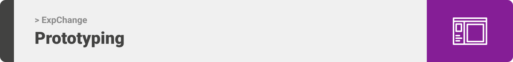

<div align="center">

> Hello world! ExpChange is an application where you can give and receive variety of products that have an expiry date. 


**[PROJECT PHILOSOPHY](https://github.com/julescript/well_app#-project-philosophy) • [WIREFRAMES](https://github.com/julescript/well_app#-wireframes) • [TECH STACK](https://github.com/julescript/well_app#-tech-stack) • [IMPLEMENTATION](https://github.com/julescript/well_app#-impplementation) • [HOW TO RUN?](https://github.com/julescript/well_app#-how-to-run)**

</div>

<br><br>


> With ExpChange, one person can help another.You can post variety of products you have with an expiry date on it as example medicine, food, skin products in exchange for another one by chatting with other users. .
> 
> Additionally, ExpChange has a category for donation where you can find donations and donate.

### User Stories
- As a user, I want to upload posts, so that other users can see my product
- As a user, I want to have a favorite list, so that I can find desired products quickly
- As a user, I want to search products, so that I can find products by name or category
- As a user, I want to chat with other users (real time chat), so that I can make deals
- As a admin, I want to see and ban users with unallowed posts, so that the app would stay safe
- As a admin, I want to approve posts before uploading, so that I can check if the post permissible


<br><br>



> This design was planned before on paper, then moved to Figma app for the fine details.
Note that i didn't use any styling library or theme, all from scratch and using pure css modules

<h1 align="center">Wireframe</h1>

| Home                | Login            | Product            |Profile           | 
| --------------------| -----------------|-----------------|----------------------|
|  |  |  |  |

<h1 align="center">Mockup</h1>


| Home (lightmode)    | Login(lightmode) | Chat(lightmode) |ProductPage(lightmode)| 
| --------------------| -----------------|-----------------|----------------------|
|  |  |  |  |

| Home (darkmode)    | Login(darkmode) | Chat(darkmode) |ProductPage(darkmode)| 
| -------------------| ----------------|----------------|---------------------|
|  |  |  |  |


<br><br>


Here's a brief high-level overview of the tech stack the Well app uses:

- This project uses the [Flutter app development framework](https://flutter.dev/). Flutter is a cross-platform hybrid app development platform which allows us to use a single codebase for apps on mobile, desktop, and the web.
- For persistent storage (database), the app uses the [MongoDB](https://www.mongodb.com/) which is a source-available cross-platform document-oriented database program. Classified as a NoSQL database program, MongoDB uses JSON-like documents with optional schemas
- This project uses the [Firebase](https://firebase.google.com) for real time chating. The Firebase Realtime Database is a cloud-hosted NoSQL database that lets you store and sync data between your users in realtime
- This project uses the [NodeJS](https://nodejs.org) for backend. Node.js is an open-source server environment. Node.js is cross-platform and runs on Windows, Linux, Unix, Mac OS, etc. Node.js is a back-end JavaScript runtime environment. Node.js runs on a JavaScript Engine and executes JavaScript code outside a web browser.


<br><br>


> Uing the above mentioned tecch stacks and the wireframes build with figma from the user sotries we have, the implementation of the app is shown as below, these are screenshots from the real app

| Home (darkmode)    | Login(darkmode) | Chat(darkmode) |ProductPage(darkmode)| 
| --------------------| -----------------|-----------------|----------------------|
|  |  |  |  |

| Home (lightmode)    | Login(lightmode) | Chat(lightmode) |ProductPage(lightmode)| 
| -------------------| ----------------|----------------|---------------------|
|  |  |  |  |


<br><br>


> This is an example of how you may give instructions on setting up your project locally.
To get a local copy up and running follow these simple example steps.

### Prerequisites

This is an example of how to list things you need to use the software and how to install them.
* npm
  ```sh
  npm i express
  ```

### Installation

_Below is an example of how you can instruct your audience on installing and setting up your app. This template doesn't rely on any external dependencies or services._

1. Get a free API Key at [https://ExpChange-apis.com](https://github.com/MaythamGhaly/exchange-app/blob/frontend/frontend/lib/apis/apis.txt)
2. Clone the repo
   ```sh
   git clone https://github.com/MaythamGhaly/exchange-app.git
   ```
3. Flutter run
   ```sh
   flutter run
   ```


